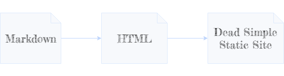

Ever wish you could simply write some markdown files and convert them into web pages for your zero-fuss static site?

Introducing Statica - a dead simple zero config static site builder for people who don't need all that fancy "stuff". 

It's perfect for static sites when you simply want to write content in markdown and easily convert them to web pages!



# Install

`npm install -g statica`

# Usage

## Create The Template File

First, you need a template that represents the "outer shell" of your HTML site.

Create a file `_template.html` in the root of your site's folder.

Next, just put whatever HTML you want into it!

## Injecting Content

Specify where content will be injected (from your markdown files) by adding the following to your template file:

`<!--@Content()-->`

The outer HTML might look like:

```html
<body>
    <h1>This is my header</h1>
    <!--@Content()-->
    <footer>
        This is my footer
    </footer>
</body>
```

## Writing Content

Write your markdown files (with an extension `.md`) anywhere you like. When compiled, each markdown file will be converted into an HTML file.

All other non-markdown files (HTML, JS, CSS, images, etc.) will be copied into `./www` for you too.

For example, your site layout might look like:


After generating the site, the compiled layout will be (inside `./www`):


## Build It!

When installed as a global npm tool, open a terminal from the root of your site then run `statica`.

The compiled web site will be copied to a `www` folder.

**That's all folks!**

# Q&A

## Can I add plain HTML files?

Yes! Statica will copy them over to the `www` folder for you when building. This might be useful for one-off pages that do differ quite a bit from your overall template.

## Where do I put my site's assets (JS, CSS, etc.)?

Anywhere you want - except directly in the `www` folder since this is generated for you.

## Can I Use NPM Modules On My Site?

Sure! Statica will ignore your `node_modules` folder when building your site. Just make sure your compiled files (via webpack, etc.) are being referenced in your HTML pages.

## My Assets (JS, CSS) aren't working in my compiled site?

Are you using relative paths?


